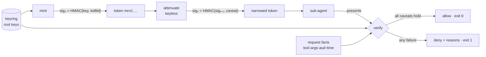

# macarune

[English](README.md) | [中文](README.zh.md) | [日本語](README.ja.md)

[](LICENSE) [](go.mod) [](CHANGELOG.md)  [](CONTRIBUTING.md)

**macarune：エージェントのツールアクセスを絞り込むための減衰可能なケイパビリティトークンを発行・検証する、オープンソースの依存ゼロ CLI ——純粋な HMAC 上の macaroon 式 caveat により、どのエージェントもトークンサーバーなしでオフラインのままサブエージェント向けに自分のトークンを狭められる。**


```bash
git clone https://github.com/JaydenCJ/macarune && cd macarune
go build -o macarune ./cmd/macarune    # single static binary, stdlib only
```

> プレリリース：v0.1.0 はまだどのパッケージレジストリにもタグ付けされていません。上記の手順でソースからビルドしてください（Go ≥1.22 で可）。

## なぜ macarune？

マルチエージェントシステムには委譲の穴がある：広範なツール権限を持つオーケストレーターがリサーチ用サブエージェントを起動するとき、そのサブエージェントは今後 2 時間 `/workspace/research/` 配下の `read_file` だけができればよい——だが*ちょうどそれだけ*を渡す良い方法がない。OAuth token exchange なら表現できるが、認可サーバー、クライアント登録、委譲のたびのネットワーク往復を引き連れてくる。同一プロセスツリーの内側では馬鹿げた話だ。JWT は scope を運べるが、絞り込むたびに署名鍵が要るため、オーケストレーターが鍵を握る（漏れたら終わり）か、サーバーに問い合わせるかの二択になる。RBAC ゲートウェイはデプロイ時にロールを固定する——必要なスコープがサブエージェント起動時に決まる世界では役に立たない。Macaroons は 2014 年に HMAC チェーンでこれを解決した：caveat を追加するたびにチェーンが再キー化され、検証が全条件の連言であるため、*トークンそのもの*が絞り込みの資格情報になる。macarune はこの構成を依存ゼロの Go バイナリにしたものであり、エージェントのツール呼び出し向けに設計された caveat 言語（`tool in read_file,list_dir`、`arg.path ^= /workspace/`、`time < …`）、fail-closed な検証器、監査ログにそのまま書ける拒否理由を備える。

| | macarune | OAuth token exchange | JWT scopes | RBAC ゲートウェイ |
|---|---|---|---|---|
| 鍵なしで資格情報を狭められる | ✅ HMAC チェーン | ❌ 認可サーバーへの往復 | ❌ 署名鍵が必要 | ❌ ロールは静的 |
| 完全オフラインで動作 | ✅ | ❌ | ✅ 検証のみ | ❌ 経路上プロキシ |
| 必要なサーバープロセス | 0 | 認可サーバー | 0 | ゲートウェイ |
| 引数レベルの制約（`arg.path ^= …`） | ✅ | ❌ scope 文字列のみ | ❌ scope 文字列のみ | ⚠️ ルート毎の設定 |
| 委譲の深さ | 無制限・単調縮小 | ホップ毎に exchange | ホップ毎に再署名 | 該当なし |
| 拒否理由が失敗した制約を名指しする | ✅ すべて | ❌ | ❌ | 実装次第 |
| 暗号面 | HMAC-SHA256 のみ | TLS + JOSE 一式 | JOSE ライブラリ | TLS + セッション |
| ランタイム依存 | 0（Go 標準ライブラリ） | AS + SDK | JOSE ライブラリ | ゲートウェイ運用 |

<sub>依存数は 2026-07-13 に確認：macarune が import するのは Go 標準ライブラリのみ。典型的な Go の JOSE/JWT ライブラリは 3–6 モジュールを引き込み、OAuth token exchange はさらに認可サーバーのデプロイを要する。</sub>

## 特徴

- **鍵なしオフライン減衰** — `sig_n = HMAC(sig_{n-1}, caveat_n)`：トークンを持っていれば狭められるので、オーケストレーターは起動時にインフラゼロで各サブエージェントのスコープを切れる。追加は狭めることしかできない——検証は連言だからだ。
- **ツール呼び出しの形をした caveat 言語** — `tool in read_file,list_dir`、`arg.path ^= /workspace/`、`arg.bytes <= 4096`、`aud = toolhost`、`time < 2026-08-01T00:00:00Z`；リクエストの実引数に対する glob・集合・前置・数値境界。
- **厳格に fail-closed** — 欠けた引数、時計の未指定、非数値の比較、検証器が解析できない caveat はすべて拒否。攻撃者は HMAC チェーンにゴミを*追加できる*が、ゴミはスキップされず拒否される。
- **監査ログにそのまま書ける拒否理由** — 失敗した caveat はすべて添字と安定した理由付きで報告される：`tool is "shell", not in {read_file, list_dir}`。
- **両側で同じ 1 バイナリ** — ツールホストは `macarune verify` で検証（終了コード 0/1、`--quiet` で終了コードのみのゲート、`--format json` で機械可読）；エージェントはパイプ経由の `macarune attenuate` で狭める。
- **改竄が露見するワイヤ形式** — `mrn1.` + 厳格 JSON の base64url；caveat の編集・削除・並べ替えは定数時間のタグ検査を壊し、デコードは厳しいサイズ上限を強制する。
- **依存ゼロ・完全オフライン** — Go 標準ライブラリのみ。トークンサーバーなし、テレメトリなし、ネットワーク通信は一切なし。

## クイックスタート

```bash
# 1. Verifier side: generate a root key (stays on the tool host, mode 600)
macarune keygen --keyring keys.json --kid root

# 2. Mint a broad token for the orchestrator
BROAD=$(macarune mint --keyring keys.json --kid root --id orc-7 \
          --caveat "aud = toolhost")

# 3. Orchestrator narrows it for a read-only sub-agent — no key involved
NARROW=$(echo "$BROAD" | macarune attenuate \
          --caveat "tool in read_file,list_dir" \
          --caveat "arg.path ^= /workspace/" \
          --caveat "time < 2026-07-13T12:00:00Z")

macarune inspect "$NARROW"
```

実際に取得した出力：

```text
macarune token (unverified — inspect never checks signatures)
  kid      root
  id       orc-7
  caveats  4
    [0] aud = toolhost
    [1] tool in read_file,list_dir
    [2] arg.path ^= /workspace/
    [3] time < 2026-07-13T12:00:00Z
  sig      2470eb03bc006c67… (hmac-sha256, 32 bytes)
```

ツールホストはルート鍵で各呼び出しを検証する（実際の出力）：

```text
$ macarune verify "$NARROW" --keyring keys.json --tool read_file \
    --arg path=/workspace/notes.md --aud toolhost --at 2026-07-13T10:00:00Z
allow  kid=root id=orc-7  4 caveat(s) hold

$ macarune verify "$NARROW" --keyring keys.json --tool shell \
    --arg path=/etc/passwd --at 2026-07-13T13:00:00Z
deny  kid=root id=orc-7  4 failure(s)
  [0] aud = toolhost — aud is "", want "toolhost"
  [1] tool in read_file,list_dir — tool is "shell", not in {read_file, list_dir}
  [2] arg.path ^= /workspace/ — arg.path is "/etc/passwd", missing prefix "/workspace/"
  [3] time < 2026-07-13T12:00:00Z — time 2026-07-13T13:00:00Z is not < 2026-07-13T12:00:00Z
```

`bash examples/delegate.sh` は委譲のストーリー全体をエンドツーエンドで実行し、`examples/toolhost-gate.sh` は `verify --quiet` が終了コードだけで実コマンドの実行をゲートする様子を示す。

## Caveat 文法

caveat 1 つにつき述語 1 つ：`<field> <op> <value>` ——完全な仕様は [docs/token-format.md](docs/token-format.md)。

| フィールド | 意味 | 演算子 |
|---|---|---|
| `tool` | リクエストのツール名 | `=` `!=` `in` `~` `^=` |
| `aud` | オーディエンス（トークンが向く検証者） | `=` `!=` `in` `~` `^=` |
| `arg.<name>` | 名前付きリクエスト引数 1 つ | `=` `!=` `in` `~` `^=` `<` `<=` `>` `>=` |
| `time` | 検証時刻、RFC 3339 | `<` `<=` `>` `>=` |

`~` は glob（`*` は任意列、`?` は 1 文字）、`^=` は前方一致（パス限定のための演算子）、数値比較は `arg.*` に、時刻比較は `time` に適用される。caveat ゼロのトークンは無記名の資格情報——実運用では最低でも `aud` caveat を付けて発行すること。

## CLI リファレンス

`macarune [keygen|mint|attenuate|inspect|verify|version]` — トークンは引数または stdin で渡す。終了コード：0 成功/許可、1 拒否、2 用法エラー、3 実行時エラー。

| フラグ | 既定値 | 効果 |
|---|---|---|
| `--keyring`（keygen/mint/verify） | — | キーリングファイル；keygen がモード 600 で作成 |
| `--kid`（keygen/mint） | `root` | 生成/発行に使うルート鍵の id |
| `--id`（mint） | ランダム 16 進 | トークン id。公開情報で、署名プリアンブルに埋め込まれる |
| `--caveat`（mint/attenuate） | — | 追加する caveat（繰り返し可） |
| `--tool` / `--aud`（verify） | 空 | `tool` / `aud` caveat と突き合わせる事実 |
| `--arg k=v`（verify） | — | リクエスト引数（繰り返し可）；未指定の引数は対応 caveat を失敗させる |
| `--at`（verify） | `now` | 評価時刻、RFC 3339；空文字列なら time caveat は fail-closed |
| `--format`（inspect/verify） | `text` | `text` または `json` |
| `--quiet`（verify） | オフ | 出力なし；終了コードが判定 |

## 検証

このリポジトリは CI を同梱しない。上記の主張はすべてローカル実行で検証される：

```bash
go test ./...            # 89 deterministic tests, offline, < 5 s
bash scripts/smoke.sh    # end-to-end delegation story, prints SMOKE OK
```

## アーキテクチャ



## ロードマップ

- [x] v0.1.0 — HMAC チェーンの mint/attenuate/verify、ツール呼び出し向け caveat 文法、引用可能な拒否理由を持つ fail-closed 検証器、mrn1 ワイヤ形式、キーリング、89 テスト + smoke スクリプト
- [ ] サードパーティ caveat（discharge トークン）によるサービス横断の委譲
- [ ] Go ライブラリ API を `internal/` から安定性保証付きで公開
- [ ] `macarune serve` — Go 以外のツールホスト向けの任意なループバック HTTP 検証器
- [ ] Caveat の静的検査（`attenuate --check`）：新しい caveat が既存の集合と両立不能なら警告
- [ ] Python と TypeScript のリファレンス検証器（この形式は HMAC 30 行で書ける）

全リストは [open issues](https://github.com/JaydenCJ/macarune/issues) を参照。

## コントリビュート

issue・議論・PR を歓迎します——ローカルのワークフロー（フォーマット、vet、テスト、`SMOKE OK`）は [CONTRIBUTING.md](CONTRIBUTING.md) を参照。入門向けタスクは [good first issue](https://github.com/JaydenCJ/macarune/issues?q=is%3Aissue+is%3Aopen+label%3A%22good+first+issue%22) のラベル付き、設計の議論は [Discussions](https://github.com/JaydenCJ/macarune/discussions) で。

## ライセンス

[MIT](LICENSE)
