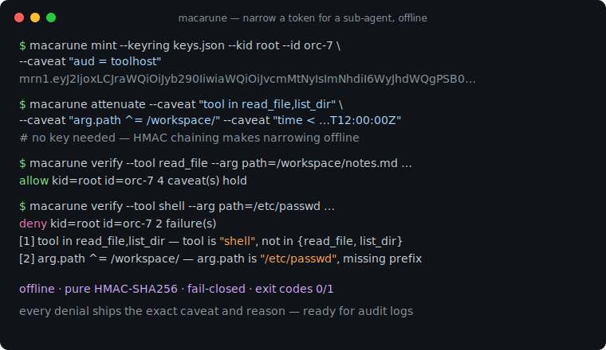
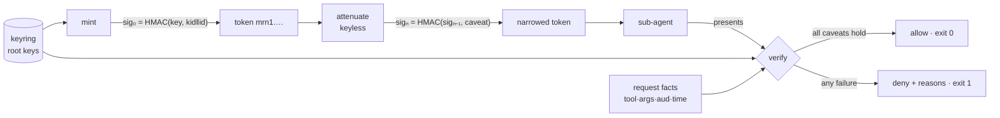

# macarune

[English](README.md) | [中文](README.zh.md) | [日本語](README.ja.md)

[](LICENSE) [](go.mod) [](CHANGELOG.md)  [](CONTRIBUTING.md)

**macarune：an open-source, zero-dependency CLI that mints and verifies attenuated capability tokens for scoping agent tool access — macaroon-style caveats over pure HMAC, so any agent can narrow its own token for a sub-agent offline, without a token server.**



```bash
git clone https://github.com/JaydenCJ/macarune && cd macarune
go build -o macarune ./cmd/macarune    # single static binary, stdlib only
```

> Pre-release: v0.1.0 is not tagged on a package registry yet; build from source as above (any Go ≥1.22).

## Why macarune?

Multi-agent systems have a delegation hole: an orchestrator holding broad tool access spawns a research sub-agent that should only ever `read_file` under `/workspace/research/` for the next two hours — and there is no good way to hand it *exactly* that. OAuth token exchange can express it, but drags in an authorization server, client registrations, and a network round trip per delegation, which is absurd inside a single process tree. JWTs can carry scopes, but every narrowing requires the signing key, so the orchestrator either holds the key (game over if it leaks) or calls home. RBAC gateways pin roles at deploy time — useless when the needed scope is decided at spawn time. Macaroons solved this in 2014 with HMAC chaining: *the token itself* is the narrowing credential, because each appended caveat re-keys the chain and verification is a conjunction. macarune is that construction as a dependency-free Go binary with a caveat language designed for agent tool calls (`tool in read_file,list_dir`, `arg.path ^= /workspace/`, `time < …`), fail-closed verification, and quotable denial reasons for your audit log.

| | macarune | OAuth token exchange | JWT scopes | RBAC gateway |
|---|---|---|---|---|
| Narrow a credential without any key | ✅ HMAC chaining | ❌ round trip to the AS | ❌ needs the signing key | ❌ roles are static |
| Works fully offline | ✅ | ❌ | ✅ verify only | ❌ in-path proxy |
| Server processes required | 0 | authorization server | 0 | gateway |
| Per-argument constraints (`arg.path ^= …`) | ✅ | ❌ scope strings | ❌ scope strings | ⚠️ per-route config |
| Delegation depth | unlimited, monotonic | one exchange per hop | re-sign per hop | n/a |
| Denial reasons name the failing constraint | ✅ every one | ❌ | ❌ | varies |
| Crypto surface | HMAC-SHA256 only | TLS + JOSE stack | JOSE stack | TLS + sessions |
| Runtime dependencies | 0 (Go stdlib) | AS + SDKs | JOSE library | gateway deploy |

<sub>Dependency counts checked 2026-07-13: macarune imports the Go standard library only; a typical Go JOSE/JWT library pulls 3–6 modules, and OAuth token exchange additionally requires an authorization server deployment.</sub>

## Features

- **Keyless offline attenuation** — `sig_n = HMAC(sig_{n-1}, caveat_n)`: holding a token is enough to narrow it, so an orchestrator scopes each sub-agent at spawn time with zero infrastructure. Appending can only ever narrow — verification is a conjunction.
- **A caveat language shaped like tool calls** — `tool in read_file,list_dir`, `arg.path ^= /workspace/`, `arg.bytes <= 4096`, `aud = toolhost`, `time < 2026-08-01T00:00:00Z`; globs, sets, prefixes, and numeric bounds over the request's actual arguments.
- **Strictly fail-closed** — missing arguments, absent clocks, non-numeric comparisons, and caveats the verifier cannot parse all deny. An attacker *can* extend the HMAC chain with garbage; garbage denies rather than being skipped.
- **Denials you can put in an audit log** — every failing caveat is reported with its index and a stable reason: `tool is "shell", not in {read_file, list_dir}`.
- **One binary on both sides** — the tool host verifies with `macarune verify` (exit 0/1, `--quiet` for pure exit-code gating, `--format json` for machines); agents narrow with `macarune attenuate` through a pipe.
- **Tamper-evident wire format** — `mrn1.` + base64url of strict JSON; editing, dropping, or reordering caveats breaks the constant-time tag check, and decode enforces hard size caps.
- **Zero dependencies, fully offline** — Go standard library only; no token server, no telemetry, no network, ever.

## Quickstart

```bash
# 1. Verifier side: generate a root key (stays on the tool host, mode 600)
macarune keygen --keyring keys.json --kid root

# 2. Mint a broad token for the orchestrator
BROAD=$(macarune mint --keyring keys.json --kid root --id orc-7 \
          --caveat "aud = toolhost")

# 3. Orchestrator narrows it for a read-only sub-agent — no key involved
NARROW=$(echo "$BROAD" | macarune attenuate \
          --caveat "tool in read_file,list_dir" \
          --caveat "arg.path ^= /workspace/" \
          --caveat "time < 2026-07-13T12:00:00Z")

macarune inspect "$NARROW"
```

Real captured output:

```text
macarune token (unverified — inspect never checks signatures)
  kid      root
  id       orc-7
  caveats  4
    [0] aud = toolhost
    [1] tool in read_file,list_dir
    [2] arg.path ^= /workspace/
    [3] time < 2026-07-13T12:00:00Z
  sig      2470eb03bc006c67… (hmac-sha256, 32 bytes)
```

The tool host verifies each call against the root key (real output):

```text
$ macarune verify "$NARROW" --keyring keys.json --tool read_file \
    --arg path=/workspace/notes.md --aud toolhost --at 2026-07-13T10:00:00Z
allow  kid=root id=orc-7  4 caveat(s) hold

$ macarune verify "$NARROW" --keyring keys.json --tool shell \
    --arg path=/etc/passwd --at 2026-07-13T13:00:00Z
deny  kid=root id=orc-7  4 failure(s)
  [0] aud = toolhost — aud is "", want "toolhost"
  [1] tool in read_file,list_dir — tool is "shell", not in {read_file, list_dir}
  [2] arg.path ^= /workspace/ — arg.path is "/etc/passwd", missing prefix "/workspace/"
  [3] time < 2026-07-13T12:00:00Z — time 2026-07-13T13:00:00Z is not < 2026-07-13T12:00:00Z
```

`bash examples/delegate.sh` runs the whole story end to end, and `examples/toolhost-gate.sh` shows `verify --quiet` gating real command execution by exit code alone.

## Caveat grammar

One predicate per caveat: `<field> <op> <value>` — full specification in [docs/token-format.md](docs/token-format.md).

| Field | Meaning | Operators |
|---|---|---|
| `tool` | tool name of the request | `=` `!=` `in` `~` `^=` |
| `aud` | audience (which verifier the token targets) | `=` `!=` `in` `~` `^=` |
| `arg.<name>` | one named request argument | `=` `!=` `in` `~` `^=` `<` `<=` `>` `>=` |
| `time` | verification clock, RFC 3339 | `<` `<=` `>` `>=` |

`~` is a glob (`*` any run, `?` one char), `^=` is prefix match (the path-scoping operator), numeric comparisons apply to `arg.*`, instant comparisons to `time`. A token with zero caveats is a bearer credential — mint with at least an `aud` caveat in anything real.

## CLI reference

`macarune [keygen|mint|attenuate|inspect|verify|version]` — tokens pass as an argument or via stdin. Exit codes: 0 ok/allow, 1 deny, 2 usage error, 3 runtime error.

| Flag | Default | Effect |
|---|---|---|
| `--keyring` (keygen/mint/verify) | — | keyring file; created by keygen with mode 600 |
| `--kid` (keygen/mint) | `root` | which root key to generate / mint under |
| `--id` (mint) | random hex | token id, public, embedded in the signature preamble |
| `--caveat` (mint/attenuate) | — | caveat to append (repeatable) |
| `--tool` / `--aud` (verify) | empty | request facts matched by `tool` / `aud` caveats |
| `--arg k=v` (verify) | — | request argument (repeatable); unlisted args fail their caveats |
| `--at` (verify) | `now` | evaluation clock, RFC 3339; empty string fails time caveats closed |
| `--format` (inspect/verify) | `text` | `text` or `json` |
| `--quiet` (verify) | off | no output; the exit code is the verdict |

## Verification

This repository ships no CI; every claim above is verified by local runs:

```bash
go test ./...            # 89 deterministic tests, offline, < 5 s
bash scripts/smoke.sh    # end-to-end delegation story, prints SMOKE OK
```

## Architecture



## Roadmap

- [x] v0.1.0 — HMAC-chained mint/attenuate/verify, tool-call caveat grammar, fail-closed verifier with quotable denials, mrn1 wire format, keyring, 89 tests + smoke script
- [ ] Third-party caveats (discharge tokens) for cross-service delegation
- [ ] Go library API promoted out of `internal/` with a stability guarantee
- [ ] `macarune serve` — optional loopback HTTP verifier for non-Go tool hosts
- [ ] Caveat linting (`attenuate --check`): warn when a new caveat is unsatisfiable against the existing set
- [ ] Reference verifiers in Python and TypeScript (the format is 30 lines of HMAC)

See the [open issues](https://github.com/JaydenCJ/macarune/issues) for the full list.

## Contributing

Issues, discussions and pull requests are welcome — see [CONTRIBUTING.md](CONTRIBUTING.md) for the local workflow (format, vet, tests, `SMOKE OK`). Good entry points are labelled [good first issue](https://github.com/JaydenCJ/macarune/issues?q=is%3Aissue+is%3Aopen+label%3A%22good+first+issue%22), and design questions live in [Discussions](https://github.com/JaydenCJ/macarune/discussions).

## License

[MIT](LICENSE)
