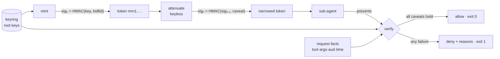

# macarune

[English](README.md) | [中文](README.zh.md) | [日本語](README.ja.md)

[](LICENSE) [](go.mod) [](CHANGELOG.md)  [](CONTRIBUTING.md)

**macarune：一个开源、零依赖的 CLI，用于铸造和验证可衰减的能力令牌，为 agent 的工具访问划定边界——基于纯 HMAC 的 macaroon 式 caveat，任何 agent 都能离线为子 agent 收窄自己的令牌，无需令牌服务器。**


```bash
git clone https://github.com/JaydenCJ/macarune && cd macarune
go build -o macarune ./cmd/macarune    # single static binary, stdlib only
```

> 预发布：v0.1.0 尚未在任何包注册表打 tag；请按上述方式从源码构建（Go ≥1.22 即可）。

## 为什么选 macarune？

多 agent 系统存在一个委派漏洞：持有宽泛工具权限的编排器（orchestrator）孵化出一个研究子 agent，而后者在接下来两小时内本应只能在 `/workspace/research/` 下 `read_file`——却没有好办法把*恰好*这些权限交给它。OAuth token exchange 能表达这种语义，但要拖上授权服务器、客户端注册，以及每次委派一趟网络往返，在同一进程树内这荒谬至极。JWT 可以携带 scope，但每次收窄都需要签名密钥，于是编排器要么持有密钥（一旦泄露满盘皆输），要么回连服务端。RBAC 网关在部署时就把角色钉死——而所需的权限范围是在孵化子 agent 时才决定的，完全帮不上忙。Macaroons 在 2014 年就用 HMAC 链解决了这个问题：*令牌本身*就是收窄的凭证，因为每追加一个 caveat 都会为链重新生成密钥，且验证是所有条件的合取。macarune 就是这个构造的零依赖 Go 二进制实现，附带一套为 agent 工具调用设计的 caveat 语言（`tool in read_file,list_dir`、`arg.path ^= /workspace/`、`time < …`）、fail-closed 的验证器，以及可直接写进审计日志的拒绝理由。

| | macarune | OAuth token exchange | JWT scopes | RBAC 网关 |
|---|---|---|---|---|
| 无需任何密钥即可收窄凭证 | ✅ HMAC 链 | ❌ 需往返授权服务器 | ❌ 需要签名密钥 | ❌ 角色是静态的 |
| 完全离线可用 | ✅ | ❌ | ✅ 仅限验证 | ❌ 串行代理 |
| 需要的服务器进程数 | 0 | 授权服务器 | 0 | 网关 |
| 参数级约束（`arg.path ^= …`） | ✅ | ❌ 只有 scope 字符串 | ❌ 只有 scope 字符串 | ⚠️ 按路由配置 |
| 委派深度 | 无限，单调收窄 | 每跳一次 exchange | 每跳重新签名 | 不适用 |
| 拒绝理由指明失败的约束 | ✅ 每一条 | ❌ | ❌ | 视实现而定 |
| 密码学面 | 仅 HMAC-SHA256 | TLS + JOSE 全家桶 | JOSE 库 | TLS + 会话 |
| 运行时依赖 | 0（Go 标准库） | AS + SDK | JOSE 库 | 网关部署 |

<sub>依赖数于 2026-07-13 核对：macarune 仅导入 Go 标准库；典型的 Go JOSE/JWT 库会拉取 3–6 个模块，OAuth token exchange 还额外需要部署一台授权服务器。</sub>

## 特性

- **无密钥离线衰减** — `sig_n = HMAC(sig_{n-1}, caveat_n)`：持有令牌就足以收窄它，编排器在孵化每个子 agent 时零基础设施地划定其权限。追加只可能收窄——验证是合取。
- **贴合工具调用的 caveat 语言** — `tool in read_file,list_dir`、`arg.path ^= /workspace/`、`arg.bytes <= 4096`、`aud = toolhost`、`time < 2026-08-01T00:00:00Z`；对请求的实际参数支持 glob、集合、前缀和数值上下界。
- **严格 fail-closed** — 缺失的参数、未提供的时钟、非数值的比较、验证器无法解析的 caveat 一律拒绝。攻击者*可以*向 HMAC 链追加垃圾；垃圾会被拒绝，而不是被跳过。
- **可直接写入审计日志的拒绝理由** — 每条失败的 caveat 都带下标和稳定的理由：`tool is "shell", not in {read_file, list_dir}`。
- **两端共用一个二进制** — 工具宿主用 `macarune verify` 验证（退出码 0/1，`--quiet` 纯退出码门禁，`--format json` 供机器消费）；agent 通过管道用 `macarune attenuate` 收窄。
- **防篡改的线格式** — `mrn1.` + 严格 JSON 的 base64url；编辑、删除或重排 caveat 都会破坏常量时间的标签校验，解码强制执行硬性大小上限。
- **零依赖、完全离线** — 仅 Go 标准库；没有令牌服务器、没有遥测、永不联网。

## 快速上手

```bash
# 1. Verifier side: generate a root key (stays on the tool host, mode 600)
macarune keygen --keyring keys.json --kid root

# 2. Mint a broad token for the orchestrator
BROAD=$(macarune mint --keyring keys.json --kid root --id orc-7 \
          --caveat "aud = toolhost")

# 3. Orchestrator narrows it for a read-only sub-agent — no key involved
NARROW=$(echo "$BROAD" | macarune attenuate \
          --caveat "tool in read_file,list_dir" \
          --caveat "arg.path ^= /workspace/" \
          --caveat "time < 2026-07-13T12:00:00Z")

macarune inspect "$NARROW"
```

真实抓取的输出：

```text
macarune token (unverified — inspect never checks signatures)
  kid      root
  id       orc-7
  caveats  4
    [0] aud = toolhost
    [1] tool in read_file,list_dir
    [2] arg.path ^= /workspace/
    [3] time < 2026-07-13T12:00:00Z
  sig      2470eb03bc006c67… (hmac-sha256, 32 bytes)
```

工具宿主用根密钥逐次验证每个调用（真实输出）：

```text
$ macarune verify "$NARROW" --keyring keys.json --tool read_file \
    --arg path=/workspace/notes.md --aud toolhost --at 2026-07-13T10:00:00Z
allow  kid=root id=orc-7  4 caveat(s) hold

$ macarune verify "$NARROW" --keyring keys.json --tool shell \
    --arg path=/etc/passwd --at 2026-07-13T13:00:00Z
deny  kid=root id=orc-7  4 failure(s)
  [0] aud = toolhost — aud is "", want "toolhost"
  [1] tool in read_file,list_dir — tool is "shell", not in {read_file, list_dir}
  [2] arg.path ^= /workspace/ — arg.path is "/etc/passwd", missing prefix "/workspace/"
  [3] time < 2026-07-13T12:00:00Z — time 2026-07-13T13:00:00Z is not < 2026-07-13T12:00:00Z
```

`bash examples/delegate.sh` 端到端跑完整个委派故事；`examples/toolhost-gate.sh` 展示 `verify --quiet` 如何仅凭退出码为真实命令执行做门禁。

## Caveat 语法

每条 caveat 一个谓词：`<field> <op> <value>`——完整规范见 [docs/token-format.md](docs/token-format.md)。

| 字段 | 含义 | 操作符 |
|---|---|---|
| `tool` | 请求的工具名 | `=` `!=` `in` `~` `^=` |
| `aud` | 受众（令牌面向哪个验证方） | `=` `!=` `in` `~` `^=` |
| `arg.<name>` | 一个具名请求参数 | `=` `!=` `in` `~` `^=` `<` `<=` `>` `>=` |
| `time` | 验证时钟，RFC 3339 | `<` `<=` `>` `>=` |

`~` 是 glob（`*` 任意串，`?` 单字符），`^=` 是前缀匹配（路径限定专用操作符），数值比较作用于 `arg.*`，时刻比较作用于 `time`。零 caveat 的令牌是不记名凭证——任何真实场景请至少带上一条 `aud` caveat 再铸造。

## CLI 参考

`macarune [keygen|mint|attenuate|inspect|verify|version]` — 令牌可作为参数传入或经 stdin 管道。退出码：0 成功/允许，1 拒绝，2 用法错误，3 运行时错误。

| 参数 | 默认值 | 作用 |
|---|---|---|
| `--keyring`（keygen/mint/verify） | — | 密钥环文件；keygen 以 600 权限创建 |
| `--kid`（keygen/mint） | `root` | 生成/铸造所用的根密钥 id |
| `--id`（mint） | 随机十六进制 | 令牌 id，公开，嵌入签名前导 |
| `--caveat`（mint/attenuate） | — | 要追加的 caveat（可重复） |
| `--tool` / `--aud`（verify） | 空 | 与 `tool` / `aud` caveat 匹配的请求事实 |
| `--arg k=v`（verify） | — | 请求参数（可重复）；未列出的参数会让其 caveat 失败 |
| `--at`（verify） | `now` | 评估时钟，RFC 3339；空字符串使时间 caveat fail-closed |
| `--format`（inspect/verify） | `text` | `text` 或 `json` |
| `--quiet`（verify） | 关 | 不输出；退出码即裁决 |

## 验证

本仓库不附带任何 CI；以上每一条声明都由本地运行验证：

```bash
go test ./...            # 89 deterministic tests, offline, < 5 s
bash scripts/smoke.sh    # end-to-end delegation story, prints SMOKE OK
```

## 架构



## 路线图

- [x] v0.1.0 — HMAC 链式 mint/attenuate/verify、面向工具调用的 caveat 语法、带可引用拒绝理由的 fail-closed 验证器、mrn1 线格式、密钥环、89 个测试 + smoke 脚本
- [ ] 第三方 caveat（discharge 令牌），支持跨服务委派
- [ ] 将 Go 库 API 从 `internal/` 提升为带稳定性承诺的公开包
- [ ] `macarune serve` — 可选的回环 HTTP 验证器，供非 Go 工具宿主使用
- [ ] Caveat 静态检查（`attenuate --check`）：当新 caveat 与既有集合不可能同时满足时给出警告
- [ ] Python 与 TypeScript 参考验证器（该格式只需 30 行 HMAC）

完整列表见 [open issues](https://github.com/JaydenCJ/macarune/issues)。

## 贡献

欢迎 issue、讨论与 PR——本地工作流（格式化、vet、测试、`SMOKE OK`）见 [CONTRIBUTING.md](CONTRIBUTING.md)。入门任务标注为 [good first issue](https://github.com/JaydenCJ/macarune/issues?q=is%3Aissue+is%3Aopen+label%3A%22good+first+issue%22)，设计讨论请移步 [Discussions](https://github.com/JaydenCJ/macarune/discussions)。

## 许可证

[MIT](LICENSE)
